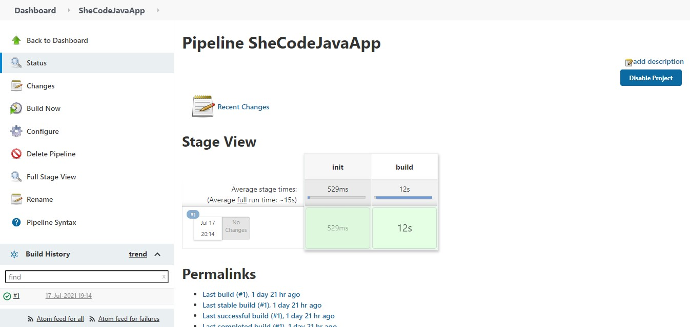
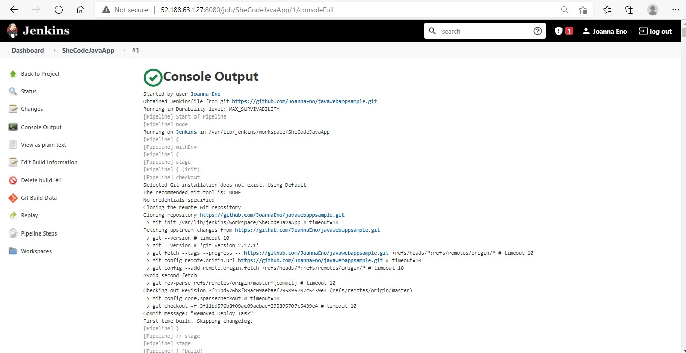

# Java Simple Number Adder

## Ping the App

- Browse to the App URL: `http://<app-url>/api/calculator/ping`
- You should see text similar to the following:

Welcome to Java Web App!!! This is updated!

Today's date

## App usage

- Browse to the app URL (substitute `<x>` and `<y>` with two values to be summed): `http://<app-url>/api/calculator/add?x=<x>&y=<y>`.

## Jenkins pipeline syntax

### Repository and Dependency Pull

## Setup Continous Integration with Azure using Jenkins
1. Go to Settings -> Integration & services, click Add service, choose Jenkins (GitHub plugin), fill in Jenkins hook url with `http://<your jenkins server>/github-webhook/`
2. Make sure your Jenkins has the following components installed:
   * JDK
   * Maven
   * Docker
   
   And the following plugins installed:
   * Azure credentials
   * Docker pipeline
   * Credentials binding
4. To deploy using FTP, create a Jenkins pipeline with `Jenkinsfile` as pipeline file.
5. To deploy using container, create a Jenkins pipeline with `Jenkinsfile2` as pipeline file.
